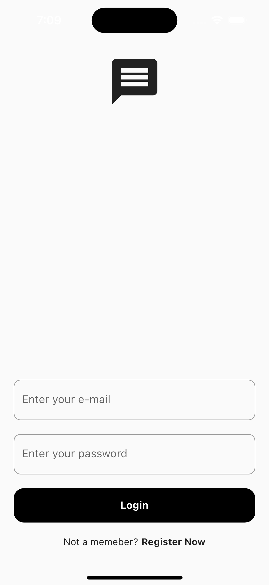
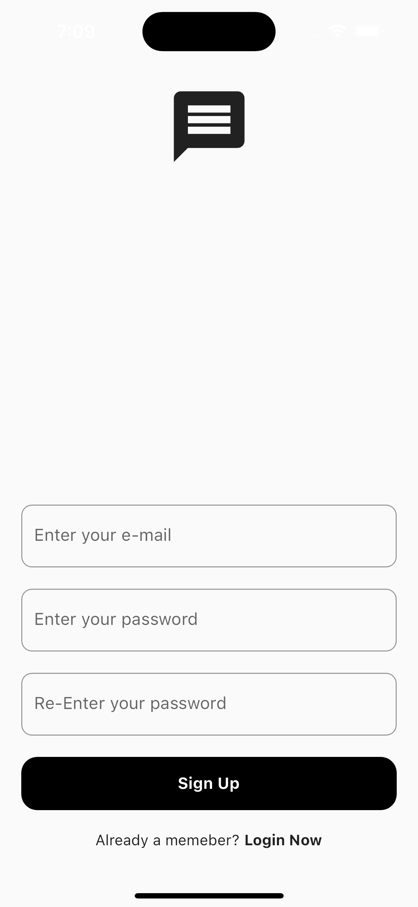
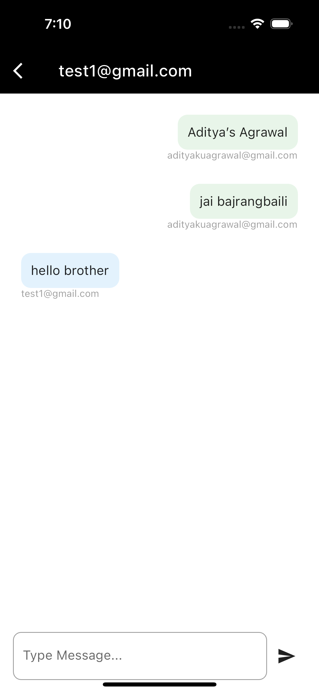

# Chat Application with Firebase Authentication

## Overview

A real-time chat application built with Flutter and Firebase that allows users to securely send and receive text messages. This application features user authentication, ensuring that messages are exchanged only between authenticated users. It is compatible with both Android and iOS platforms.

## Features

- **User Authentication**: Users can sign up, log in, and reset their passwords securely with Firebase Authentication.

- **Real-time Messaging**: Enjoy real-time chat functionality with instant message delivery and updates.

- **Cross-Platform Compatibility**: The app is developed using Flutter, making it accessible on both Android and iOS devices.

- **User Profiles**: Users can create profiles, upload avatars, and manage their personal information.

- **Messaging History**: The application stores chat history for easy reference and conversation continuity.

## Installation

1. Clone the repository:

   ```shell
   git clone https://github.com/yourusername/Messaging-Application.git

2. Change directory to the project folder:
    ```shell
    cd Messaging-Application

3. Install the required dependencies:
    ```shell
    flutter pub get
    
4. Run the application:
    ```shell
    flutter run

## Configuration

To use this application, you'll need to configure Firebase in your project. Follow these steps:

1. Firebase Project Setup:
* Go to the Firebase Console and create a new Firebase project.
* Add your Android and iOS apps to your Firebase project and follow the setup instructions for each platform.
2. Download and Add Configuration Files:
* For Android, download the google-services.json file and place it in the android/app directory of your project.
* For iOS, download the GoogleService-Info.plist file and add it to the ios/Runner directory of your project.
3. Initialize Firebase in Your Code:
* In your Flutter project, you should have a firebase_options.dart file. If you removed it or didn't have one, create it in the lib directory.
* In firebase_options.dart, add the Firebase configuration for your project, including your apiKey, authDomain, projectId, and other necessary details. Here's a
  
```
import 'package:firebase_core/firebase_core.dart';

class FirebaseOptions {
  static final FirebaseOptions _instance = FirebaseOptions._privateConstructor();

  factory FirebaseOptions() {
    return _instance;
  }

  FirebaseOptions._privateConstructor();

  final FirebaseApp app = FirebaseApp(
    name: 'YourAppName',
    options: FirebaseOptions(
      apiKey: 'YOUR_API_KEY',
      authDomain: 'YOUR_AUTH_DOMAIN',
      projectId: 'YOUR_PROJECT_ID',
      // Add other Firebase configurations as needed
    ),
  );
}
```

Replace 'YOUR_API_KEY', 'YOUR_AUTH_DOMAIN', and 'YOUR_PROJECT_ID' with your Firebase project details.

4. Connect the Configuration to Your App:
In your app's code, make sure to initialize Firebase using the firebase_options.dart configuration file. Here's an example of how to initialize Firebase in your Flutter app:
```
void main() async {
  WidgetsFlutterBinding.ensureInitialized();
  await Firebase.initializeApp(options: FirebaseOptions().app.options);
  runApp(MyApp());
}
```

This should be done in the main.dart or wherever you initialize your app.
Now, your app is configured to use Firebase for user authentication and real-time messaging. Remember to keep your firebase_options.dart file secure and exclude it from version control (you should already have it in your .gitignore).

 ## Screenshots

### Login Screen


### Register Screen


### User List Screen


### Chat Screen


## Usage

* Launch the app and sign up or log in with your credentials.
*  Start chatting with other users in real-time.
*  Visit your profile page to manage your personal information and avatar.


## Technologies Used

* Flutter: https://flutter.dev
* Firebase: https://firebase.google.com

## Acknowledgments

Thanks to the Flutter and Firebase communities for their valuable resources and support.
